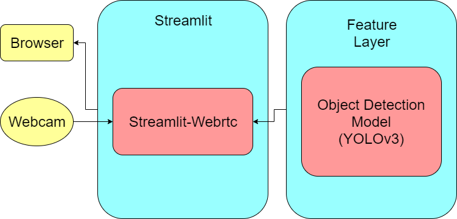
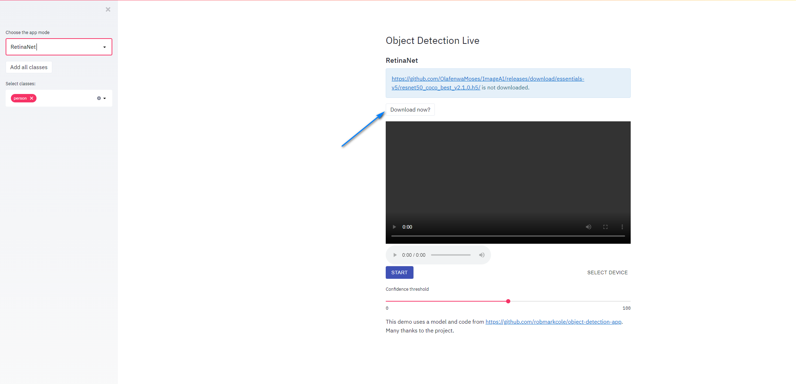
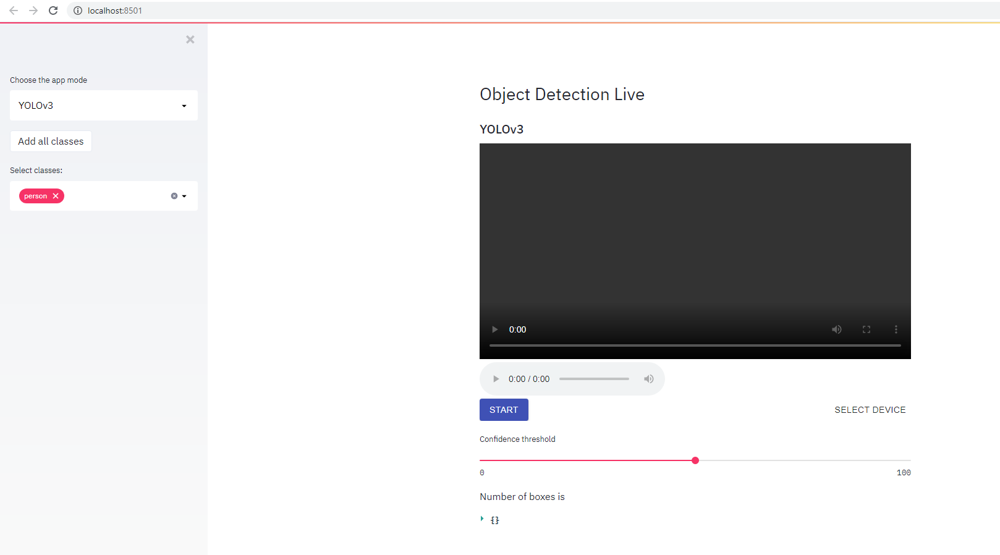

# Team 3 Week 8 Introduction: Webcam object detection
This application is a streamlit web application which live stream from the host webcam and perform a live object detection.
<br/>

## WebLink
Heroku App Link: https://still-harbor-44570.herokuapp.com/
<br/>

To use the app: Go to the weblink, start the app and use the "Download now" button provided to automatically download the model weights on the fly.
<br/>

## How I deployed Streamlit App on Heroku
### Install Heroku Client
First install Heroku client on your laptop from: https://devcenter.heroku.com/articles/heroku-cli  
This helps you to be able to call Heroku commands from your command line.


### Create Requirement.txt
Go to your console and go to your path directory of choice. Key in this command to export a `requirement.txt` file that contains all the packages in Python that was needed
```
pip install pipreqs
```

`requirement.txt` should look like
```
omegaconf==1.4.1
tensorflow-cpu==1.15.0rc1
keras==2.1.3
av==8.0.0
matplotlib==2.0.0
pillow==6.2.0
opencv_python==3.1.0.4
imageai==2.0.2
streamlit==0.63.0
streamlit_webrtc==0.5.0
```
### Create setup.sh
Make `setup.sh` in your folder and it should look like
```
mkdir -p ~/.streamlit/

echo "[server]
headless = true
port = $PORT
enableCORS = false
" > ~/.streamlit/config.toml
```

### Create Procfile
You can use a bash to 
`touch Procfile` or `nano Procfile`.  
Go into the file using an editor, and input
```
web: sh setup.sh && streamlit run src/app.py
```

## Seting up Heroku and Deploying
Create a Heroku account. Go to your command line, go to that folder path you want to deploy
```
heroku login
```
This will open up a browser window, enter your login details and you’ll see a login confirmation message in your CLI.

You can now start to deploy through creating a Heroku app using the command heroku create. This will create a Heroku instance for you with a random name assigned. In my case, its `still-harbor-44570`.

### Create remote connection to connect to git locally
```
cd still-harbor-44570
git config user.email "<your_email>"
git config user.name "<your_username>"
git branch
```
`git branch` was meant to check which branch you are in. We should be in `master` branch only since we did not create any new branches


### For Streamlit webstr
if you have mismatch in commits between local and remote branch
```
heroku git:clone -a still-harbor-44570
```
For Streamlit streamer, you need a file named `Aptfile` that looks like:
```
libgl1
```
which helps install some dependencies in the Ubuntu-- system in Heroku
```
heroku buildpacks:add --index 1 heroku-community/apt
```
If there are no remote connection between the local branch to the remote branch, use:
Link: https://docs.github.com/en/github/importing-your-projects-to-github/adding-an-existing-project-to-github-using-the-command-line
```
heroku git:remote -a still-harbor-44570
```
###Now to deploy
```
git add .
git commit -m "Enter your message here"
git push heroku master
```
If your compiled app is less than 500Mb , then it can be successfully deployed(assuming no bugs or dependency issues). I have played with multiple package versions to finally allow a usable copy, yet is less than 500MB after deployment.

Success message will look like:
```
remote: -----> Compressing...
remote:        Done: 485.7M
remote: -----> Launching...
remote:  !     Warning: Your slug size (485 MB) exceeds our soft limit (300 MB) which may affect boot time.
remote:        Released v27
remote:        https://still-harbor-44570.herokuapp.com/ deployed to Heroku
remote:
remote: Verifying deploy... done.
To https://git.heroku.com/still-harbor-44570.git
   76099a9..b181099  master -> master

```


## Overall Architecture / Design

<br/>
### Frontend Layer
The web application frontend utilize the [streamlit](https://www.streamlit.io/) package for hosting the web server. An additional [streamlit-webrtc](https://github.com/whitphx/streamlit-webrtc) package is used for streaming support from the host webcam.  
The streamlit-webrtc streamer consume the Feature class from the feature layer to provide object detection inference and annotation support.  
The user is able to filter the classes of object for detection via a dropdown list on the UI. Additionally, a confidence threshold slider is provided to limit the confidence level for detection boxes to show up.  
#### Download model weights
If the model weights are not downloaded, the app will check, and prompt you to download by clicking on the "Download Now?" button

#### Run the Model
Once you have the model in your local drive, you can press "Start" to start your video streaming live. You can click on the left panel widgets for customisations of what models to use, and what objects you want the model to detect.
For now, our models available are  
1) YoloV3  
2) RetinaNet  
Both retrieved from the ImageAI website at https://imageai.readthedocs.io/en/latest/video/

Users can also slide the slider on `Confidence Threshold` in the body of the app. If we set it to "50", it means that bounding boxes with confidence of 50% and above will be displayed, if not, it will not show up on the screen.
<br/>

### Feature Layer
The feature layer consists of the Feature class which inherits from the [VideoTransformerBase](https://github.com/whitphx/streamlit-webrtc/blob/master/streamlit_webrtc/transform.py) abstract class required for streamlit-webrtc streaming operations.  
The Feature class initialize a Model object from the model layer and is assigned as an attribute of the Feature class for the purpose of object detection interence. Model type is determine by the configuration in `config/feature_config.yaml`.  
The Feature class also include a count feature which tally the count of object detected for their respective classes.  
<br/>

### Model Layer
The model layer consists of the Model class which initialize an object detection model dependent on the model type configured from the feature layer.  
The default object detection model used is the `YOLOv3` and `RetinaNet` object detection model from the [ImageAI](https://github.com/OlafenwaMoses/ImageAI) package.
<br/>
<br/>


## Acknowledgement
**streamlit**: https://www.streamlit.io/  
**streamlit-webrtc**: https://github.com/whitphx/streamlit-webrtc  
**streamlit-webrtc**: https://github.com/tconkling/streamlit_heroku_example
**ImageAI**: https://github.com/OlafenwaMoses/ImageAI  
**HerokuDeployment**: https://medium.com/analytics-vidhya/how-to-deploy-a-streamlit-app-with-heroku-5f76a809ec2e
**HerokuDeployment**: https://towardsdatascience.com/deploy-streamlit-on-heroku-9c87798d2088
